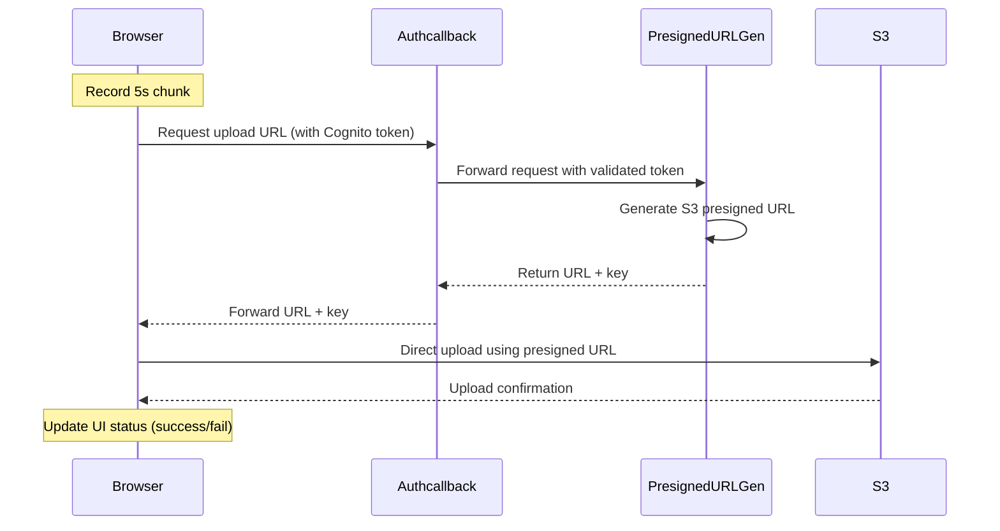

# Audio Recording and S3 Upload Service

## Architecture Overview

This service enables browser-based audio recording with direct S3 uploads, authenticated through AWS Cognito. The system uses a chunked recording approach where audio is recorded in configurable time segments (e.g., 5 or 10 seconds) and uploaded directly to S3.

### System Flow


## Key Components

### 1. Browser Client (index.html)
- Handles audio recording in configurable chunk sizes
- Manages recording UI and status indicators
- Performs direct uploads to S3 using presigned URLs

### 2. Authentication Callback Service (authcallback.py)
- Manages Cognito authentication flow
- Validates user sessions
- Forwards presigned URL requests to PresignedURLGen
- Maintains consistent authentication state

### 3. Presigned URL Generator (presigned_url_gen.py)
- Generates S3 presigned URLs for file uploads
- Manages S3 path construction
- Handles file naming using UTC timestamps

## S3 Storage Structure

Files are stored in S3 using the following path structure:
```
users/{user_type}/{provider}/{user.sub}/{timestamp}.webm
```
Where:
- `user_type`: Type of user (e.g., "customer")
- `provider`: Authentication provider (e.g., "cognito")
- `user.sub`: Unique user identifier
- `timestamp`: UTC timestamp in format YYYY-MM-DD-HH-MM-SS-μs

## Implementation Plan

### Phase 1: Basic Upload Flow
1. Add presigned URL endpoint to authcallback.py
2. Implement authentication forwarding to PresignedURLGen
3. Update browser client to use new endpoint
4. Test single chunk upload flow

### Phase 2: Enhancement and Error Handling
1. Add upload status tracking in UI
2. Implement upload status indicators
3. Add basic error handling
4. Test with various chunk sizes

### Phase 3: Future Improvements (Planned)
- Implement retry logic for failed uploads
- Add concurrent recording session handling
- Enhance file naming for better sequence tracking
- Add server-side upload verification

## Security Considerations

### Authentication
- All requests flow through authcallback service
- Cognito token validation is centralized
- Session management handled in one location

### File Upload
- Direct browser-to-S3 upload using presigned URLs
- Time-limited presigned URLs
- User-specific S3 paths

### CORS Configuration
- Configured for specific domains only
- Handles cross-origin requests securely

## Development Setup

[To be added: Local development setup instructions]

## Testing

[To be added: Testing instructions]

## API Documentation

[To be added: API endpoint documentation]

## Contributing

[To be added: Contribution guidelines]
