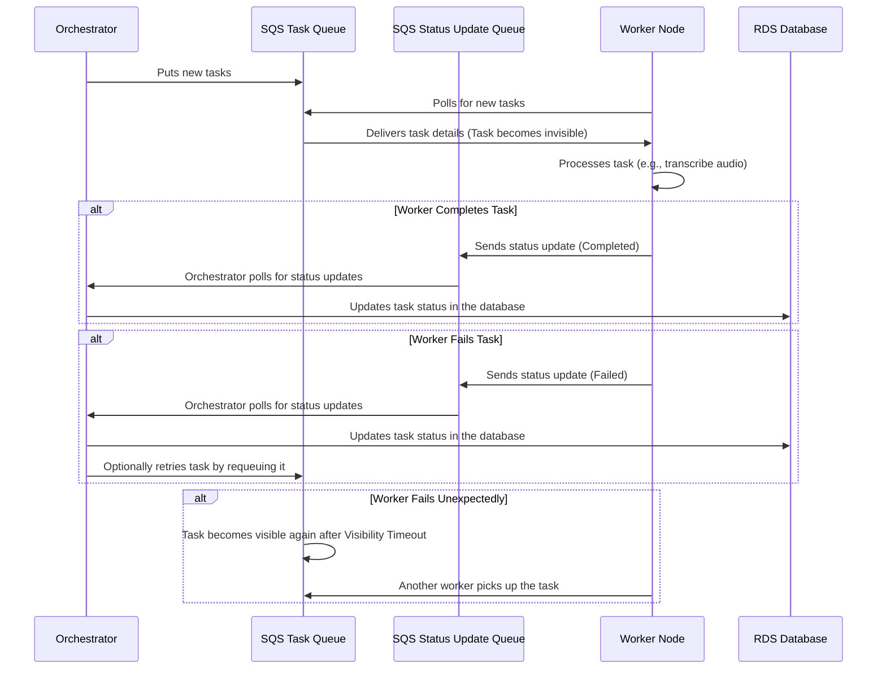

V2 Orchestrator: Using **multiple SQS queues** without heartbeats for failure detection. We'll leverage **Visibility Timeout** to handle failures and retries. This design simplifies the architecture, ensuring task assignment, status updates, and retries are managed efficiently.

---

# Task Management System Using Multiple SQS Queues (No Heartbeat)

## Overview

This design outlines a system that uses **multiple SQS queues** for managing tasks between an **Orchestrator** and multiple **Worker Nodes**. The system ensures that tasks are processed, statuses are updated, and failures are automatically handled through **visibility timeouts** without using heartbeat signals. The main components are:
- **Orchestrator**: Sends tasks to worker nodes and handles task status updates.
- **Worker Nodes**: Process tasks and send status updates back to the orchestrator.
- **SQS Task Queue**: Holds tasks that need to be processed by worker nodes.
- **SQS Status Update Queue**: Receives status updates from worker nodes.
- **Visibility Timeout**: Used to automatically requeue tasks if a worker fails to complete a task within a set timeframe.

---

## Architecture Components

1. **Orchestrator**:
   - Manages task generation and sends tasks to the **SQS Task Queue**.
   - Polls the **SQS Status Update Queue** to receive task status updates (e.g., `Completed`, `Failed`).
   - Updates task statuses in an **RDS Database**.

2. **Worker Nodes**:
   - Poll the **SQS Task Queue** for tasks to process.
   - After processing, send status updates to the **SQS Status Update Queue**.

3. **SQS Task Queue**:
   - Stores tasks that need to be processed by worker nodes.
   - Uses **Visibility Timeout** to automatically make tasks available for reprocessing if a worker fails or is terminated before completing the task.

4. **SQS Status Update Queue**:
   - Receives status updates from worker nodes after they complete or fail tasks.
   - Orchestrator processes these updates to maintain task status in the RDS database.

5. **RDS Database**:
   - Stores task metadata, such as:
     - Task ID
     - Status (`Pending`, `In-progress`, `Completed`, `Failed`)
     - Timestamps for when tasks were created, updated, or retried.
   - This allows tracking of task progress and provides an audit trail.

---

## Task Flow and Error Handling

### 1. Task Assignment via SQS Task Queue
- The **Orchestrator** generates tasks and pushes them into the **SQS Task Queue**.
- **Worker Nodes** poll the **Task Queue** for new tasks.
- When a worker retrieves a task, it becomes invisible for a defined **visibility timeout** (e.g., 5 minutes). The worker processes the task during this time.

### 2. Task Processing by Worker Nodes
- The worker node processes the task (e.g., downloading a file, performing transcription, uploading results).
- After processing the task, the worker sends a **status update** to the **SQS Status Update Queue** indicating whether the task was `Completed` or `Failed`.

### 3. Status Updates via SQS Status Update Queue
- The **Orchestrator** polls the **Status Update Queue** to retrieve status updates from workers.
- Upon receiving a status update, the orchestrator updates the task’s status in the **RDS Database**.

### 4. Handling Worker Node Failures with Visibility Timeout
- If the worker node **fails** or **is terminated** (e.g., spot instance termination) before completing a task, the **Visibility Timeout** ensures the task becomes visible in the **SQS Task Queue** again after the timeout period.
- This allows another worker to pick up the task and retry it.
- No heartbeat is required; task failure recovery is handled automatically by **Visibility Timeout**.

### 5. Task Retry Mechanism
- If a task is explicitly marked as `Failed` by a worker node (e.g., due to a network failure, resource unavailability), the orchestrator can:
  - Either push the task back into the **SQS Task Queue** for retry.
  - Or mark the task as `Failed` in the **RDS Database** for later investigation.

---

## Sequence Diagram

Here’s a sequence diagram showing how tasks are processed, status updates are handled, and task failures are recovered using **Visibility Timeout**:

### Key Points of the Diagram:
1. **Task Assignment**: The orchestrator sends tasks to the **Task Queue**. Worker nodes poll this queue to retrieve tasks.
2. **Task Processing**: The worker node processes the task, and upon completion, sends a status update to the **Status Update Queue**.
3. **Orchestrator Handling**: The orchestrator retrieves status updates from the **Status Update Queue** and updates the task status in the **RDS Database**.
4. **Failure Handling**: If a worker node fails to complete a task before the visibility timeout expires, the task becomes visible again in the **Task Queue** for another worker to pick up and retry.

---

## Handling Task Failures

### Recoverable Failures:
- If a task fails due to temporary reasons (e.g., network failure, service unavailability), the worker sends a status update indicating failure. The orchestrator can decide whether to retry the task by placing it back in the **Task Queue**.

### Unrecoverable Failures:
- If a task fails in a way that can’t be retried (e.g., data corruption), the worker can send a `Failed` status update with details about the failure. The orchestrator marks the task as `Failed` in the **RDS Database**.

---

## Advantages of This Design

1. **Automatic Task Recovery**:
   - The **Visibility Timeout** ensures that if a worker fails, the task will automatically be retried by another worker without the need for additional components like heartbeats.

2. **Separation of Concerns**:
   - The **SQS Task Queue** handles task assignment, while the **SQS Status Update Queue** handles task status updates, simplifying the flow of messages and making the system easier to maintain.

3. **Scalability**:
   - Multiple worker nodes can process tasks in parallel by polling the **Task Queue**, making the system highly scalable.

4. **Reduced Complexity**:
   - The system avoids the complexity of heartbeat monitoring, as the **Visibility Timeout** ensures tasks are not lost if a worker fails unexpectedly.

5. **Flexible Failure Handling**:
   - The orchestrator can choose to automatically retry failed tasks or mark them as `Failed` in the **RDS Database** for manual investigation later.

---

## Next Steps

- **Implement SQS Queues**:
  - Set up two SQS queues: one for tasks and one for status updates.
- **Worker Node Logic**:
  - Implement worker nodes to poll the **Task Queue** for tasks and send status updates to the **Status Update Queue**.
- **Orchestrator Logic**:
  - Build the orchestrator to manage task assignment, poll the status queue, and update task statuses in the **RDS Database**.

