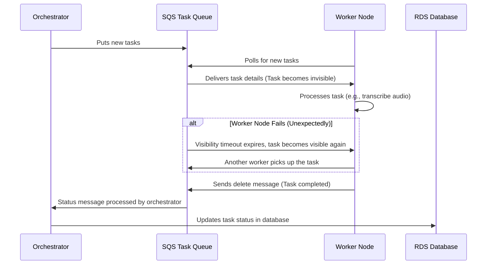

Here's a simplified version of the architecture using **visibility timeout** as the primary failure-handling mechanism, written in a way that's easy to understand for someone new to the concept:

---

# Simplified Task Management Architecture Using SQS and Visibility Timeout

## Overview

This document outlines a **simplified architecture** for task management using **AWS SQS** (Simple Queue Service) and a feature called **Visibility Timeout**. The goal of this system is to handle tasks (like processing files) using **worker nodes** that retrieve tasks from a queue, process them, and then update the system when they’re done. If something goes wrong, the system automatically retries the task without losing progress.

We’re keeping things simple, so we’ll explain everything step by step.

### Key Concepts

1. **Orchestrator**: The brain of the system that manages tasks. It puts tasks into a queue and tracks the progress of tasks.
2. **Worker Nodes**: These are computers (or programs) that do the actual work. They pick up tasks from the queue, process them (like converting audio files to text), and then mark the task as done.
3. **SQS Task Queue**: This is like a to-do list for the worker nodes. Tasks go into this queue, and the workers pull tasks from it to process.
4. **Visibility Timeout**: A special feature of SQS that ensures if a worker node fails or doesn’t finish a task, the task automatically gets put back on the to-do list for another worker to pick up.
5. **RDS Database**: A place where we store information about tasks, like when they were started, if they’re in progress, or if they’ve been completed.

---

## Task Lifecycle

### 1. Task Assignment (SQS Task Queue)
- The **Orchestrator** puts new tasks into the **SQS Task Queue**. These tasks could be anything, like processing a file, converting an audio file to text, or generating a report.
- The **Worker Nodes** poll (or "ask") the **Task Queue** for new tasks. When a task is assigned to a worker, it becomes **invisible** to other workers for a set amount of time. This is called the **Visibility Timeout**.

### 2. Task Processing by Worker Nodes
- Once a worker node picks up a task, it starts processing. This could involve downloading a file, running computations, or performing some transformation (e.g., transcribing an audio file).
- If the worker finishes the task, it sends a message back to the **Task Queue** saying that the task is **completed**. This removes the task from the queue.

### 3. Handling Worker Node Failures (Visibility Timeout)
- **Visibility Timeout** is like a safety net. If the worker node doesn’t finish the task (for example, if it crashes, loses power, or is terminated), the task will automatically become visible again in the queue after the timeout period.
- Once the timeout expires, another worker can pick up the task and try to complete it.
- This means the system can automatically recover from failures without any extra effort. The task just gets retried.

### 4. Updating Task Status (RDS Database)
- While all this is happening, the **Orchestrator** keeps track of task statuses in an **RDS Database**. This database is used to store whether a task is:
  - **Pending**: Waiting to be picked up.
  - **In-progress**: Being worked on by a worker node.
  - **Completed**: Finished successfully.
  - **Failed**: If something goes wrong, the task could be marked as failed, but it will get retried automatically by the visibility timeout.

---

## Key Features Explained

### What is a Visibility Timeout?

Imagine you have a group of workers picking tasks from a shared to-do list. When one worker picks up a task, we don’t want another worker to pick the same task at the same time, right? The **Visibility Timeout** solves this.

- When a worker picks up a task, it becomes invisible to other workers for a set amount of time (let’s say 5 minutes).
- If the worker finishes within that time, it marks the task as **done**.
- If the worker doesn’t finish (maybe the worker fails or takes too long), the task becomes visible again for other workers to pick up.

This ensures that tasks are always completed, even if a worker crashes or fails.

### Why We Don’t Need Extra Complex Features (like Heartbeats)

In some systems, workers have to constantly report back to say, “I’m still working, don’t give this task to someone else.” This is called a **heartbeat**. But with **Visibility Timeout**, we don’t need that!

- **Visibility Timeout** acts like a built-in safety feature. If the worker doesn’t finish in time, the task just gets put back in the queue automatically.
- This makes the system much simpler to manage and understand.

### What Happens if a Task Fails?

If a worker crashes or is stopped (for example, if it's a spot instance that’s suddenly terminated), the task won’t be marked as completed. Once the **visibility timeout** expires, the task becomes visible again, and another worker can pick it up.

- There’s no need for a special retry mechanism or error-handling system. **SQS** takes care of retries by itself.

### How Do We Track Task Progress?

The **Orchestrator** tracks task progress using the **RDS Database**. Every time a worker picks up or completes a task, the orchestrator updates the database with the task’s current status. This way, we can always check:
- Which tasks are still waiting to be picked up.
- Which tasks are currently being worked on.
- Which tasks have been completed.

---

## Example Scenarios

### Scenario 1: Successful Task Completion
1. The **Orchestrator** puts a task into the **Task Queue**.
2. A **Worker Node** picks up the task and starts processing.
3. The worker completes the task and sends a message to **SQS** to mark the task as completed.
4. The **Orchestrator** updates the task status in the **RDS Database** to "Completed."

### Scenario 2: Worker Node Failure
1. The **Orchestrator** puts a task into the **Task Queue**.
2. A **Worker Node** picks up the task but crashes (maybe due to a hardware failure or spot instance termination).
3. The **Visibility Timeout** expires, and the task becomes visible in the **Task Queue** again.
4. Another **Worker Node** picks up the task and completes it successfully.
5. The **Orchestrator** updates the task status in the **RDS Database**.

---

## Advantages of This Simplified System

### 1. **Automatic Failure Recovery**:
   - If a worker node fails to complete a task, we don’t need to do anything manually. The task is automatically retried thanks to **Visibility Timeout**.

### 2. **No Extra Heartbeats or Status Polling**:
   - Unlike more complex systems, we don’t need to constantly check if workers are still alive or working. The visibility timeout does this job for us.

### 3. **Simplicity**:
   - We only need a **single task queue**. No need for extra queues for retries or special logic to handle task failures. This keeps the system easy to understand and maintain.

### 4. **Scalable**:
   - This system works whether you have 5 worker nodes or 500. As more workers are added, they can all pull from the same **SQS Task Queue** and handle tasks in parallel.

---

## Sequence Diagram

Here’s a simple diagram that shows how everything works:

---

## Conclusion

This architecture provides a **simple and scalable** way to handle tasks using **SQS** and **Visibility Timeout**. By using SQS’s built-in features, we can ensure that tasks are retried automatically if anything goes wrong, without the need for complex error-handling or retry mechanisms.

### Next Steps:
- Implement the **SQS Task Queue** and configure a reasonable **visibility timeout** based on your task requirements.
- Set up the **worker nodes** to process tasks from the queue and handle task completion.
- Use the **RDS database** to track task statuses and manage reporting.

---

Feel free to let me know if you have questions or if you’d like to proceed with implementing this system!
