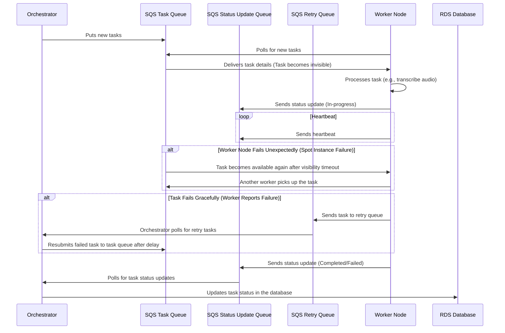

Orchestrator V2 Proposal

# Document
This `.md` document that explains orchestrator v2 key concepts of the system, focusing on the multiple SQS queues, worker node behavior, visibility timeout, retry handling, and the overall architecture. This will provide the foundation for thinking about implementation.
What is different here over Orchestrator V1, is that there is a RDS database, and there are multiple SQS queues.
---

# Multi-Queue Orchestrator Architecture for Task Management

## Overview

This document outlines a resilient and scalable architecture for task management using **AWS SQS** queues, a central **orchestrator**, and **worker nodes** that process tasks asynchronously. The architecture includes handling both **graceful failures** and **unexpected worker node failures** (e.g., spot instance termination) with the use of **Visibility Timeouts** and a **Retry Queue**.

## Sequence Diagram

---

### Key Components

1. **Orchestrator**: Manages task assignment, status updates, and retries. It coordinates between worker nodes and the database (RDS).
2. **Worker Nodes**: These nodes pull tasks from the **Task Queue**, process them (e.g., audio transcription), and send status updates or failures back to the orchestrator.
3. **SQS Task Queue**: Used for assigning tasks to worker nodes.
4. **SQS Status Update Queue**: Receives status updates (e.g., `Completed`, `Failed`) from worker nodes.
5. **SQS Retry Queue**: Handles tasks that have failed and need to be retried after a delay.
6. **RDS Database**: Stores task statuses and metadata, managed by the orchestrator.

## Task Lifecycle

### 1. Task Assignment (Task Queue)
- The **Orchestrator** generates tasks and pushes them to the **Task Queue**.
- **Worker Nodes** poll the **Task Queue** to retrieve tasks. Once a task is picked up, it becomes invisible to other workers for a set **Visibility Timeout** period.

### 2. Task Processing
- Worker nodes download input data, process it (e.g., transcribe audio), and upload the results to a destination (e.g., S3).
- While processing, the worker node sends periodic **heartbeat messages** to the **Status Update Queue** to signal that it’s still alive and working on the task.

### 3. Visibility Timeout and Worker Failure
- If the worker node fails (e.g., spot instance termination) and does not complete the task or send status updates, the **Visibility Timeout** expires, and the task becomes visible again in the **Task Queue**.
- Another worker node can pick up the task for reprocessing.

### 4. Task Status Updates (Status Update Queue)
- After completing the task (or encountering a recoverable failure), the worker node sends a status update (`Completed`, `Failed`) to the **Status Update Queue**.
- The **Orchestrator** polls the **Status Update Queue** to retrieve task status updates and updates the **RDS Database** accordingly.

### 5. Retry Mechanism (Retry Queue)
- If the worker node encounters a recoverable failure (e.g., network issue, API rate limit), it sends the task to the **Retry Queue**. The **Retry Queue** introduces a delay before reprocessing the task to give the system time to recover.
- The **Orchestrator** polls the **Retry Queue** and resubmits the failed task to the **Task Queue** for retry after the delay.

---

## Key Concepts

### 1. **Visibility Timeout**
- When a worker node retrieves a task from the **Task Queue**, the task becomes **invisible** for the duration of the **Visibility Timeout**.
- If the worker node fails to complete the task within this period, the task becomes visible again in the **Task Queue** for another worker to pick up.
- This ensures that tasks aren’t lost due to unexpected worker failures.

### 2. **Heartbeats**
- Worker nodes send periodic **heartbeat messages** to the **Status Update Queue** while processing tasks.
- If the orchestrator does not receive a heartbeat within a certain period, it can assume the worker node has failed and can take action (e.g., resubmit the task).

### 3. **Retry Queue**
- When a worker node encounters a **graceful failure** (e.g., network issue, API rate limit), it sends the failed task to the **Retry Queue** for delayed reprocessing.
- The **Retry Queue** introduces a delay before retrying the task, allowing time for the issue to resolve (e.g., rate limit reset, network recovery).
- The orchestrator polls the **Retry Queue** and resubmits the task to the **Task Queue** for reprocessing.

### 4. **RDS Database**
- The **Orchestrator** maintains task status updates in the **RDS Database**.
- Task statuses include:
  - **Pending**: Task is waiting to be assigned.
  - **In-progress**: Task is being processed by a worker node.
  - **Completed**: Task has been successfully processed.
  - **Failed**: Task failed and may be retried.

---

## Scenarios Handled by the Architecture

### A. **Worker Node Failure (Unexpected)**
- If a worker node fails without completing a task (e.g., spot instance termination), the task becomes available again in the **Task Queue** after the visibility timeout.
- Another worker node can pick up the task and complete it.

### B. **Graceful Failure (Recoverable)**
- If a worker node encounters a **recoverable failure** (e.g., API rate limiting, network issues), it sends the task to the **Retry Queue**.
- The orchestrator resubmits the task to the **Task Queue** after the delay for reprocessing.

### C. **Task Completion**
- After processing a task, the worker node sends a `Completed` status to the **Status Update Queue**.
- The orchestrator updates the task status in the **RDS Database**.

---

## Example Use Cases for Retry Queue

1. **Network Issues**: Worker node experiences temporary network issues while downloading a file.
2. **Rate Limiting**: Worker node hits an API rate limit and must delay retrying.
3. **Service Unavailability**: External services (e.g., database, storage) are temporarily down for maintenance.

---

## Conclusion

This architecture uses **multiple SQS queues** to handle task management, retries, and failures in a resilient manner. It ensures that tasks are not lost due to worker node failures and that recoverable errors are retried in a controlled manner.

### Next Steps:
- Implement the **Task Queue**, **Status Update Queue**, and **Retry Queue** using AWS SQS.
- Modify worker nodes to send heartbeats and status updates.
- Update the orchestrator to manage task status in the RDS database.

---

Let me know if you'd like to proceed with any specific part of the implementation or further clarification on any aspect of this architecture!
