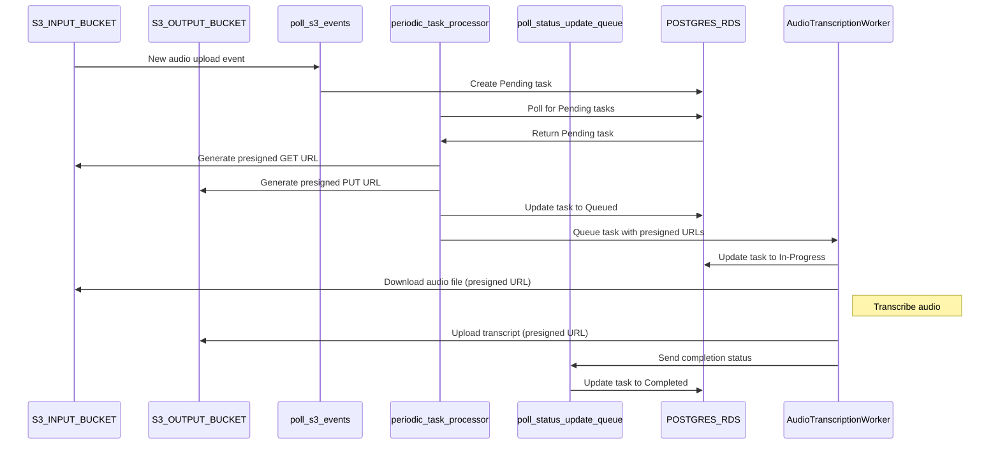

### Database Schema Using RDS for Task Tracking

To replace the SQS DLQ with a relational database (such as RDS using PostgreSQL or MySQL), we'll implement a schema that stores and manages task data, failure states, retries, and more. Below is an explanation of the schema and how it maps to the orchestration system you’re building.

#### Task Table Schema Overview
This schema tracks the lifecycle of tasks, including retries and failures, in a centralized relational database.

#### **Task Table**
| **Column**           | **Data Type**                | **Description**                                                                 |
|----------------------|------------------------------|---------------------------------------------------------------------------------|
| **task_id**          | UUID (Primary Key)            | Unique identifier for each task. Generated when a task is created.               |
| **object_key**        | String                       | S3 key for the input audio file associated with this task.                       |
| **worker_id**         | String (Nullable)            | Identifier for the worker processing this task.                                 |
| **status**            | Enum (Pending, In-progress, Completed, Failed) | Current status of the task.                                                     |
| **created_at**        | Timestamp                    | Timestamp of when the task was created.                                          |
| **updated_at**        | Timestamp                    | Timestamp of the last update to the task.                                        |
| **failure_reason**    | String (Nullable)            | Optional field for storing failure details if the task fails.                    |
| **retries**           | Integer                      | The number of retries for this task.                                             |
| **presigned_get_url** | String                       | Presigned URL for downloading the audio file from S3.                            |
| **presigned_put_url** | String                       | Presigned URL for uploading the transcription result to S3.                      |
| **retry_at**          | Timestamp (Nullable)         | Time when the task should be retried after a failure.                            |

---

### Column Descriptions:
- **task_id**: A unique identifier for each task, allowing tracking throughout its lifecycle. Tasks are created when new audio files are detected in S3, and this UUID ensures that each task is distinct, even if retried.
- **object_key**: The S3 object key corresponding to the audio file this task processes. Workers use this key to access the file and store the result.
- **worker_id**: The ID of the worker currently or previously processing the task. This helps with debugging, load balancing, and tracing processing across workers.
- **status**: The current status of the task, which transitions from **Pending** to **In-progress**, **Completed**, or **Failed**. This helps track where the task is in its lifecycle.
- **created_at** and **updated_at**: Timestamps for when the task was created and last updated, which can be used for tracking task progress and performance analysis.
- **failure_reason**: When a task fails, this column captures the failure details, allowing workers to retry or investigate errors. Common reasons might include network issues, transcription failures, or S3 errors.
- **retries**: Tracks how many times the task has been retried. A maximum retry count can be implemented using this value, helping to avoid infinite retry loops.
- **presigned_get_url** and **presigned_put_url**: The pre-generated, temporary URLs used by workers to download the audio file from S3 and upload the transcription result.
- **retry_at**: After a failure, this column can be set with a future timestamp, allowing workers or automated systems to know when to retry the task.

---

### Example Task States
- **Pending**: Task created, waiting to be processed.
- **In-progress**: Task picked up by a worker and currently being processed.
- **Completed**: Task successfully completed, transcription result uploaded.
- **Failed**: Task failed during processing, with failure reason stored and retries potentially scheduled.

---

### Sample Data:

| **task_id**       | **object_key**           | **worker_id** | **status**    | **created_at**       | **updated_at**       | **failure_reason**              | **retries** | **presigned_get_url**         | **presigned_put_url**        | **retry_at**             |
|-------------------|--------------------------|---------------|---------------|----------------------|----------------------|---------------------------------|-------------|-------------------------------|------------------------------|--------------------------|
| `abc123`          | `audio/filename1.wav`     | `worker-1`    | Pending       | 2024-10-13 12:30:00  | 2024-10-13 12:30:00  | NULL                            | 0           | `<presigned_get_url_1>`       | `<presigned_put_url_1>`      | NULL                     |
| `def456`          | `audio/filename2.wav`     | `worker-2`    | In-progress   | 2024-10-13 12:35:00  | 2024-10-13 12:36:00  | NULL                            | 0           | `<presigned_get_url_2>`       | `<presigned_put_url_2>`      | NULL                     |
| `ghi789`          | `audio/filename3.wav`     | `worker-1`    | Failed        | 2024-10-13 12:40:00  | 2024-10-13 12:41:00  | "Failed to upload transcription" | 1           | `<presigned_get_url_3>`       | `<presigned_put_url_3>`      | 2024-10-13 13:00:00      |
| `jkl012`          | `audio/filename4.wav`     | `worker-3`    | Completed     | 2024-10-13 12:45:00  | 2024-10-13 12:50:00  | NULL                            | 0           | `<presigned_get_url_4>`       | `<presigned_put_url_4>`      | NULL                     |

---

### Advantages of Using an RDS Database

1. **Persistent Tracking**: Unlike SQS DLQ, which might discard messages after a while, an RDS database provides persistent storage of task metadata, including failures and retries.
   
2. **Detailed Failure Logging**: By storing failure reasons in the database, you can analyze and track trends in why tasks fail, which can lead to more efficient system improvements and debugging.

3. **Flexible Retry Mechanism**: Rather than relying on SQS for retry logic, the database allows you to define custom retry policies (e.g., a retry counter and a retry timestamp), giving you full control over when and how tasks are retried.

4. **Centralized Reporting**: Using SQL queries, you can easily generate reports on task performance, failure rates, retry counts, and worker efficiency. This level of analysis is more difficult in systems like SQS DLQ.

5. **Transaction Management**: Since RDS databases support transactions, you can ensure that task updates (e.g., status changes, retries) are consistent and isolated, preventing race conditions or data corruption.

---

### Integration Into Your System

- **Task Creation**: When a new task is identified (e.g., a new audio file in S3), it is inserted into the **tasks** table with an initial **Pending** status.
- **Task Assignment**: Workers request tasks from the database, and the orchestrator updates the task’s status to **In-progress** and assigns the worker.
- **Task Completion**: Once a task is successfully processed, the worker updates the status to **Completed** and uploads the transcription result to S3.
- **Failure and Retry Handling**: When a task fails, the system logs the failure reason and schedules a retry by setting the **retry_at** timestamp and incrementing the retry counter. A periodic job can check for tasks ready to be retried and reassign them to workers.

---

This schema gives you a robust, flexible way to manage tasks and failures. Would you like to move forward with the implementation or adjust any part of the design?
