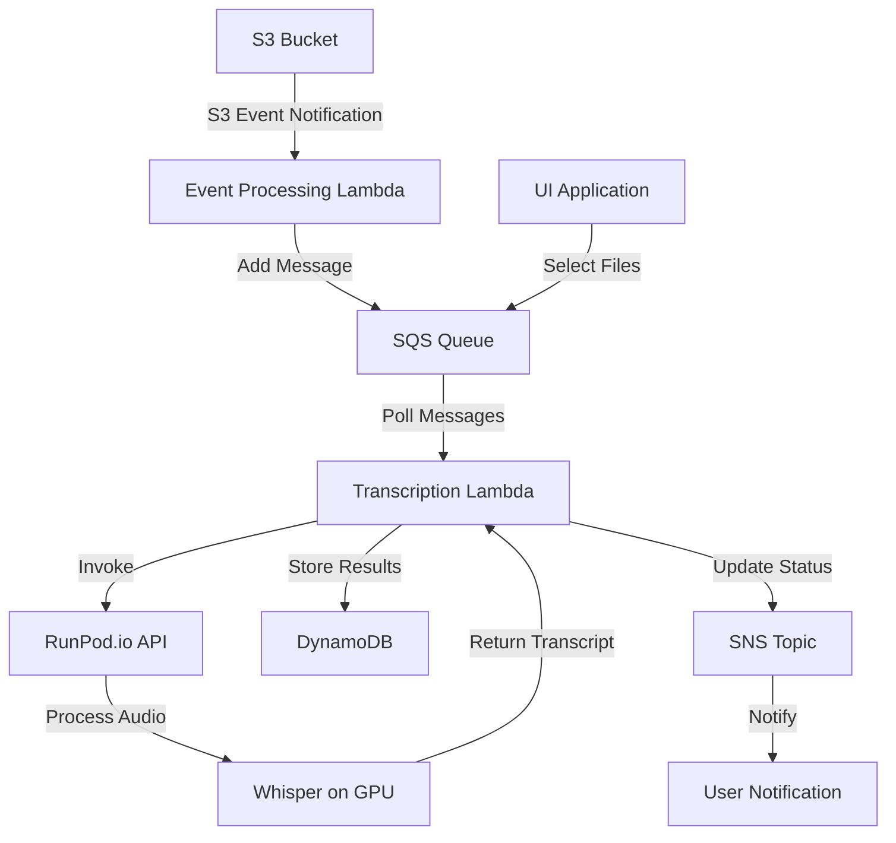

Really the graph should show the just top part up until the invoke of the Transcription service.  This component really is about adding S3 events to the SQS queue.

1. S3 Event Notifications:
   - S3 can be configured to send event notifications when specific actions occur in the bucket.
   - In this case, we'd set up notifications for object creation events (e.g., 's3:ObjectCreated:*').

2. Event Types:
   - We can specify exact event types like 's3:ObjectCreated:Put' for uploads via PUT, 's3:ObjectCreated:Post' for browser-based uploads, etc.

3. Event Filtering:
   - S3 allows filtering of events based on object key name prefixes and suffixes.
   - We could use this to only trigger events for certain file types (e.g., '.mp3', '.wav').

4. Destination Configuration:
   - S3 events can be sent directly to several AWS services. In our case, we'd configure it to trigger a Lambda function.

5. Event Processing Lambda:
   - This Lambda function is directly triggered by the S3 event.
   - It receives event data including details about the uploaded file (bucket name, object key, size, etc.).

The process now looks like this:

1. A file is uploaded to the S3 bucket.
2. S3 automatically generates an event based on our configuration.
3. This event directly triggers our Event Processing Lambda.
4. The Lambda function processes the event data and adds a message to the SQS queue.

Benefits of using S3 events:

1. Immediacy: Events are triggered in near real-time when files are uploaded.
2. Reduced Polling: No need to continually check S3 for new files.
3. Granular Control: Can specify exactly which events should trigger processing.
4. Scalability: S3 can handle a high volume of events reliably.
